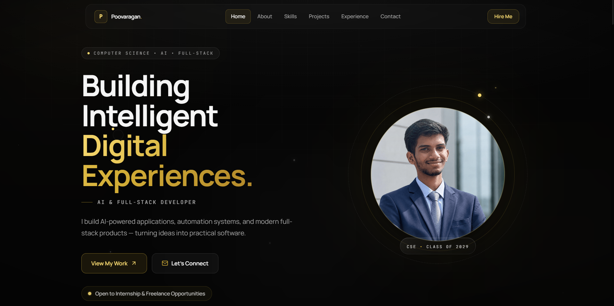
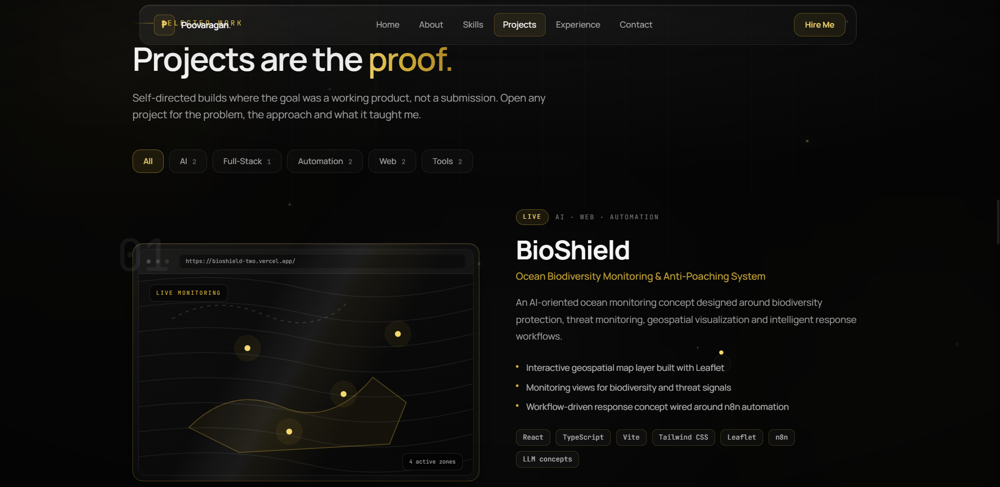

# 👨‍💻 Poovaragan — Developer Portfolio

### AI & Full-Stack Developer Portfolio

A modern developer portfolio showcasing my work in **AI, full-stack development, automation, and software engineering**.

The portfolio is designed to present my projects, technical skills, experience, and current areas of exploration through a responsive and interactive interface.

<p align="center">

<a href="https://poovaragan-portfolio.vercel.app/">

</a>

</p>

---

## ✨ Highlights

* 🎨 Modern responsive portfolio interface
* ⚡ Fast Vite-powered frontend
* 🧩 Component-based React architecture
* 🎞️ Framer Motion animations
* 🌙 Dark glassmorphism-inspired UI
* 📱 Responsive design
* ♿ Accessibility-conscious components
* ⌨️ Keyboard-friendly navigation
* 🧠 Project-focused developer showcase
* 🚀 Deployed with Vercel

---

## 📸 Preview

### 🏠 Portfolio Hero

<p align="center">
  
</p>

### 🚀 Projects

<p align="center">
  
</p>

---

## 🛠️ Tech Stack

### Frontend

* React
* TypeScript
* Vite
* Tailwind CSS

### UI & Animation

* Framer Motion
* Lucide React
* Responsive CSS

### Deployment

* Vercel
* GitHub

---

## 🧩 Portfolio Sections

The portfolio is organized around the areas that represent my current development journey.

### 👨‍💻 About

Introduction, development interests, and current focus.

### 🛠️ Skills

Technical skills across programming, AI, full-stack development, automation, and developer tooling.

### 🚀 Projects

Selected projects demonstrating practical development experience.

### 📚 Experience & Learning

Current learning journey and technical exploration.

### 📫 Contact

Ways to connect and collaborate.

---

## 🏗️ Project Architecture

The portfolio uses a lightweight static frontend architecture.

```text
                    Portfolio
                        │
                        ▼
                  React + Vite
                        │
             ┌──────────┴──────────┐
             ▼                     ▼
        UI Components          Content Data
             │                     │
             ▼                     ▼
      Tailwind + Motion      Projects / Skills
             │                     │
             └──────────┬──────────┘
                        ▼
                    Vercel
```

---

## 📁 Project Structure

```text
Poovaragan-Portfolio/
│
├── assets/
│   ├── hero.png
│   └── projects.png
│
├── public/
│
├── src/
│   ├── components/
│   ├── data/
│   └── ...
│
├── README.md
├── package.json
├── tsconfig.json
└── vite.config.ts
```

---

## 🚀 Run Locally

### Clone the repository

```bash
git clone https://github.com/poovaragansiva-collab/Poovaragan-Portfolio.git
```

### Navigate into the project

```bash
cd Poovaragan-Portfolio
```

### Install dependencies

```bash
npm install
```

### Start development server

```bash
npm run dev
```

The development server will provide the local URL through Vite.

---

## 🏗️ Production Build

Build the project:

```bash
npm run build
```

Preview the production build:

```bash
npm run preview
```

---

## 🌐 Live Website

### [poovaragan-portfolio.vercel.app](https://poovaragan-portfolio.vercel.app/)

The latest production version is deployed using Vercel.

---

## 🎯 Current Focus

I'm currently focused on building practical systems around:

```text
🤖 AI Agents
🧠 Local LLMs
⚙️ AI Automation
🌐 Full-Stack Development
🔐 Cybersecurity
🐍 Python & DSA
```

---

## 🔮 Future Improvements

Planned improvements include:

* More advanced project case studies
* Interactive project demonstrations
* AI-powered portfolio assistant
* Improved project filtering
* More detailed technical write-ups
* Additional accessibility improvements
* Continuous UI and performance optimization

---

## 👨‍💻 About Me

I'm **Poovaragan**, a CSE student and aspiring AI & Full-Stack Developer interested in building practical software products.

I enjoy learning by:

> **Building → Breaking → Debugging → Improving → Shipping**

---

## 📫 Connect

**GitHub**
https://github.com/poovaragansiva-collab

**LinkedIn**
https://www.linkedin.com/in/poovaragans

**Portfolio**
https://poovaragan-portfolio.vercel.app/

---

<div align="center">

### Building practical software with AI, automation & full-stack technologies.

⭐ Explore the projects and follow the journey.

</div>
